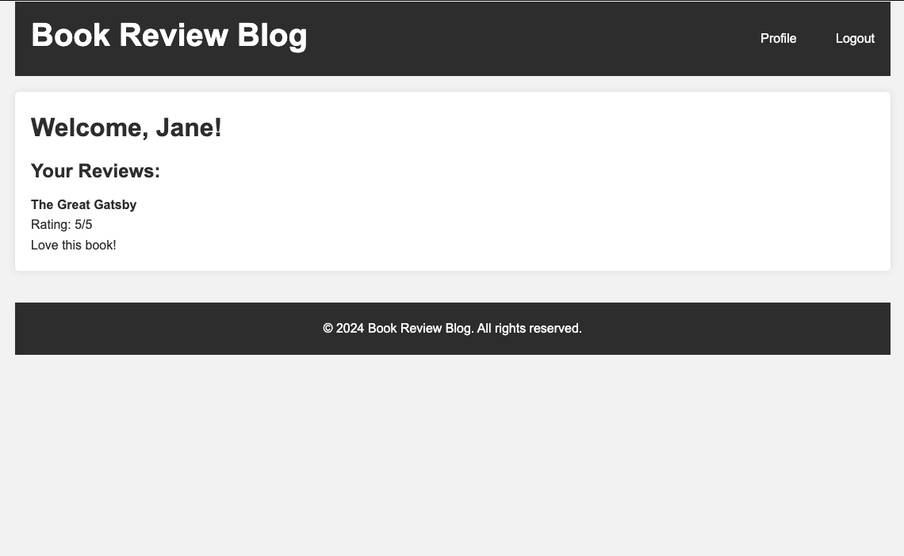

# Book-Reviewer

Book Reviewer is an application that readers can leave reviews and view reviews of books from other users.

## Instalation

The user can open this webpage in their browser uisng the URL.

## Usage

The user will have to make a profile in order to leave reviews. Once they make a profile using their name, email, and password, the user will be able to see options to add a book to the database or search for a book currently in the database. If the user chooses to add a book, they'll be prompted a form to fill out for the book. If the user chooses to search for a book, they'll be prompted to search for a book and once they choose a book they will be able to view reviews from other users and they can leave their own review.

## Screenshot

## Links

    Github: https://github.com/mirandarb/Book-Reviewer
    Deployment: